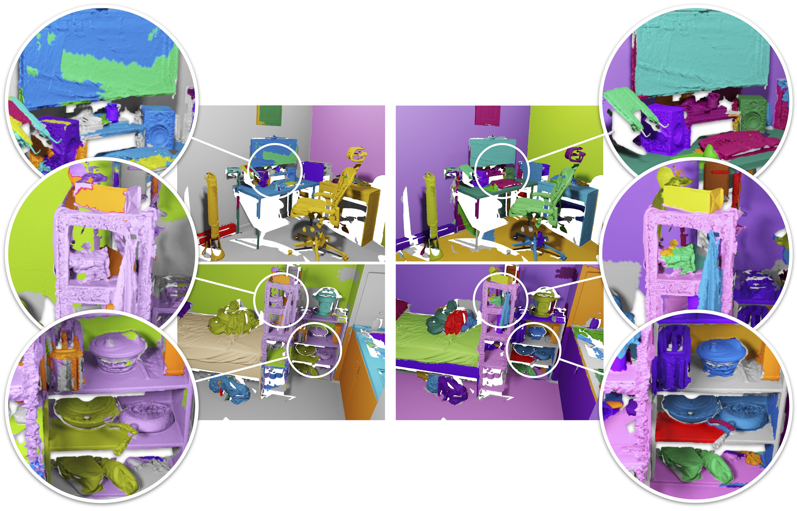

## Segment3D: Learning Fine-Grained Class-Agnostic 3D Segmentation without Manual Labels

<div align="center">
<a href="https://scholar.google.com/citations?user=ieN4b1QAAAAJ&hl=zh-CN&oi=sra">Rui Huang</a><sup>1</sup>,
<a href="https://pengsongyou.github.io">Songyou Peng</a><sup>2</sup>, 
<a href="https://aycatakmaz.github.io">Ayça Takmaz</a><sup>2</sup>,
<a href="https://federicotombari.github.io/">Federico Tombari</a><sup>3</sup>,
<a href="https://people.inf.ethz.ch/pomarc/">Marc Pollefeys</a><sup>2,4</sup>,
<a href="https://scholar.google.com/citations?user=rw6vWdcAAAAJ&hl=zh-CN">Shiji Song</a><sup>1</sup>,
<a href="https://www.gaohuang.net/">Gao Huang</a><sup>1*</sup>,
<a href="https://francisengelmann.github.io/">Francis Engelmann</a><sup>2,3</sup>

<sup>1</sup>Tsinghua University &nbsp;&nbsp; <sup>2</sup>ETH Zurich &nbsp;&nbsp; <sup>3</sup>Google &nbsp;&nbsp; <sup>4</sup>Microsoft


*Segment3D (right) predicts accurate segmentation masks, outperforming fully-supervised 3D segmentation methods like Mask3D (left), without requiring manually labeled 3D training data.*

</div>

[[Project Webpage](https://segment3d.github.io/)] &nbsp;&nbsp; [[Paper](https://arxiv.org/pdf/2312.17232)]

### Table of Contents
1. [Dependencies](#dependencies)
2. [Demo](#demo)
3. [Training](#training)
   - [Stage 1](#training-stage-1)
   - [Stage 2](#training-stage-2)
4. [Inference](#inference)
5. [Citation](#citation)
6. [Acknowledgements](#acknowledgements)

### Dependencies
We follow the main dependencies of Mask3D:
```yaml
python: 3.10.9
cuda: 11.3
```
You can set up a conda environment as follows:
```
# Some users experienced issues on Ubuntu with an AMD CPU
# Install libopenblas-dev (issue #115, thanks WindWing)
# sudo apt-get install libopenblas-dev

export TORCH_CUDA_ARCH_LIST="6.0 6.1 6.2 7.0 7.2 7.5 8.0 8.6"

conda env create -f environment.yml

conda activate mask3d_cuda113

pip3 install torch==1.12.1+cu113 torchvision==0.13.1+cu113 --extra-index-url https://download.pytorch.org/whl/cu113
pip3 install torch-scatter -f https://data.pyg.org/whl/torch-1.12.1+cu113.html
pip3 install 'git+https://github.com/facebookresearch/detectron2.git@710e7795d0eeadf9def0e7ef957eea13532e34cf' --no-deps

mkdir third_party
cd third_party

git clone --recursive "https://github.com/NVIDIA/MinkowskiEngine"
cd MinkowskiEngine
git checkout 02fc608bea4c0549b0a7b00ca1bf15dee4a0b228
python setup.py install --force_cuda --blas=openblas

cd ../Segmentator
git checkout 3e5726500896748521a6ceb81271b0f5b2c0e7d2
make

cd ../pointnet2
python setup.py install

cd ../../
pip3 install pytorch-lightning==1.7.2

conda install cuml
```
To set up the `segment-anything` model:
```
cd third_party
git clone git@github.com:facebookresearch/segment-anything.git
```
Replace the `automatic_mask_generator.py` with the provided version to enable multi-scale mask generation, and move `process.py` to `third_party/segment-anything/scripts/`:
```
cd segment-anything
pip install -e .
```

### Demo

1. Download the pre-trained [checkpoint](https://drive.google.com/file/d/1Swq9d7rjV2Q1lTuXiKh1z0OZPt9V4sgO/view?usp=drive_link) and [demo data](https://drive.google.com/drive/folders/1I-X4WP5r7rx6HCN4_hZhToYfAQ7HA7H_?usp=drive_link). Place the checkpoint in `checkpoints/` and the data in `demo_test/`.

2. (Optional) To use your own test data:
   - Apply the Graph-Based Image Segmentation algorithm to your test scenes (see [original repository](https://github.com/ScanNet/ScanNet/tree/master/Segmentator)).
   - Place the mesh and segmentations in `demo_test/TEST_SCENE/`.

3. Run the demo:
   ```bash
   bash scripts/run_demo.sh TEST_SCENE
   ```
4. Visualize results with [PyViz3D](https://francisengelmann.github.io/PyViz3D/):
   ```bash
   python -m http.server 6008
   ```
   Open a browser and navigate to `localhost:6008`.


### Training stage 1
Download the 2D data from [ScanNet](https://github.com/ScanNet/ScanNet) to `data/processed/scannet`. Your folder structure should look like this:
```
scannet
├── scene1
│   ├── color
│   ├── depth
│   ├── intrinsic
│   ├── pose
├── scene2
├── ...
```
Download the SAM checkpoints from [here](https://github.com/facebookresearch/segment-anything) and follow their instructions to generate 2D masks:
```
cd third_party/segment-anything
python scripts/process.py  --checkpoint "PATH_TO_SAM_CHECKPOINT" --model-type vit_h
```
Train Mask3D on the ScanNet dataset:
```bash
bash scripts/train_stage1.sh
```

### Training stage 2
Download the 3D data from [ScanNet](https://github.com/ScanNet/ScanNet) and preprocess the datasets:
```
python -m datasets.preprocessing.scannet_preprocessing preprocess \
--data_dir="PATH_TO_RAW_SCANNET_DATASET" \
--save_dir="data/processed/scannet200" \
--git_repo="PATH_TO_SCANNET_GIT_REPO" \
--scannet200=true
```

Generate 3D masks for 3D data:
```
bash scripts/generate_masks_trainset.sh
bash scripts/generate_masks_valset.sh
```
Select confident masks as pseudo labels to finetune the 3D segmentation model:
```bash
bash scripts/train_stage2.sh
```


### Inference
Download 3D data from [ScanNet++](https://kaldir.vc.in.tum.de/scannetpp/) and preprocess the datasets.
```
python -m datasets.preprocessing.scannetpp_preprocessing preprocess \
--data_dir="PATH_TO_RAW_SCANNETPP_DATASET" \
--save_dir="data/processed/scannetpp" \
```
Evaluate the model:
```bash
bash scripts/eval.sh
```


## BibTeX :pray:
```
@article{Huang2023Segment3D,
  author    = {Huang, Rui and Peng, Songyou and Takmaz, Ayca and Tombari, Federico and Pollefeys, Marc and Song, Shiji and Huang, Gao and Engelmann, Francis},
  title     = {Segment3D: Learning Fine-Grained Class-Agnostic 3D Segmentation without Manual Labels},
  journal   = {European Conference on Computer Vision (ECCV)},
  year      = {2024}
}
```

## Acknowledgement :clap:
We borrow the source code of [Mask3D](https://github.com/JonasSchult/Mask3D) and [segment-anything-langsplat](https://github.com/minghanqin/segment-anything-langsplat), we sincerely thank the authors for their efforts.